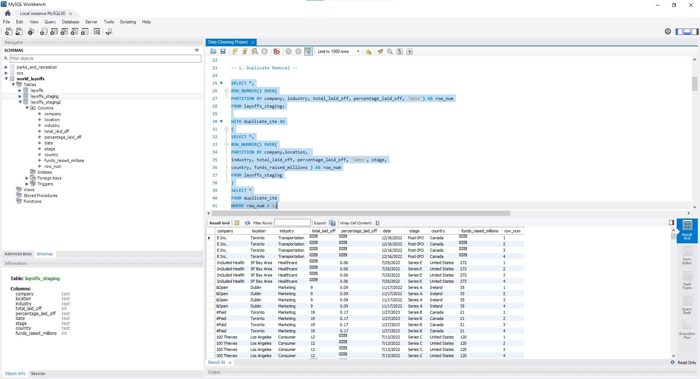
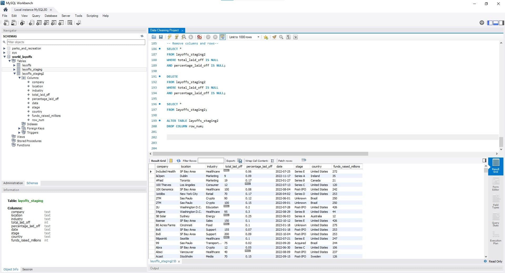

# MySQL Data Cleaning Project – Layoffs Dataset

## Overview
This project demonstrates a complete **data cleaning workflow using MySQL**.  
The goal is to take a raw layoffs dataset and transform it into a **clean, standardized, and analysis-ready table** using SQL only.

The project follows best practices such as using **staging tables**, **window functions**, and **CTEs** to ensure the original data remains untouched.

---

## Dataset
- **Original table:** `layoffs`
- **Staging tables:**
  - `layoffs_staging`
  - `layoffs_staging2` (final cleaned table)

---

## Project Objectives
- Remove duplicate records
- Standardize inconsistent text fields
- Handle null and blank values
- Clean and format date fields
- Produce a final clean table for analysis

---
## Remove Duplicates
- Duplicates are identified using the ROW_NUMBER() window function and removed using a CTE.
- ROW_NUMBER() OVER (
  PARTITION BY company, industry, total_laid_off,
  percentage_laid_off, `date`
) AS row_num

  ## Standardized the Data
-Trimmed company names
- Standardized industry and country values
- Fixed inconsistent formatting
- Converted date columns to proper date format

  ## Handle Null and Blank Values
- Replaced blank strings with NULL
- Populated missing industries using self-joins where possible
- Removed rows with insufficient data when necessary

  ## Final Clean Table
- The fully cleaned dataset is stored in:
- layoffs_staging2
This table is ready for analysis and visualization.

## Screenshots

### Final Cleaned Table

